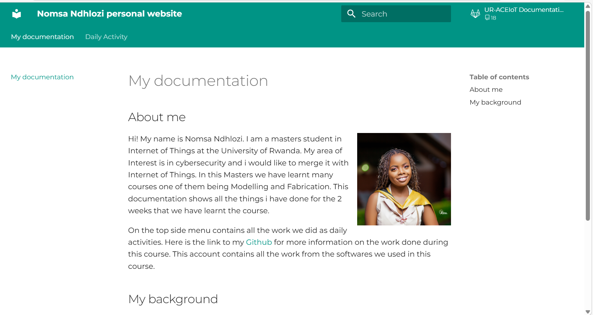
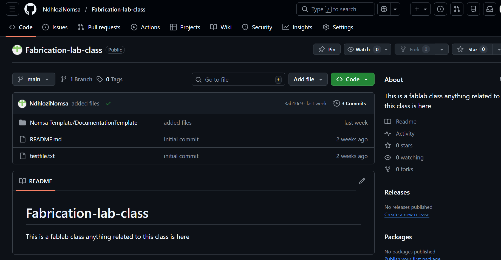

# 1. Activity of Day 1

## Activity1
## Building a Documentation Website with MkDocs Material
In this activity, I was introduced to documenting my modeling and fabrication work using MkDocs with the Material theme. At first, I saw documentation as something done after finishing a project, but this activity changed that perspective.

As I began organizing my work into a website, I realized that documentation actually forces me to think more clearly about why I made certain design decisions, not just what I made. Writing about my modeling process helped me notice gaps in my thinking and better understand how my ideas evolved.Below is the screnshot of my webpage that i made and below the page you will find the link to the whole website where i documented everything.

{ width=800 align=center }

## What I Learned

This activity helped me understand that:

Documentation is part of the design process, not an extra task. Explaining my workflow made my design logic clearer. Visuals and written explanations work together to communicate ideas. Good documentation makes my work easier to revisit and improve.
## Activity2

## Publishing Documentation via GitHub Pages
In this activity, I learned how to take my local MkDocs documentation and publish it online using GitHub and GitHub Pages. This was my first time sharing technical documentation publicly, and it made me more aware of how others would read and use my work.

Uploading my project to GitHub helped me understand that documentation is not just for myself or my instructor, but for anyone who might want to learn from or reproduce my work. Knowing that the site would be publicly accessible pushed me to be clearer and more intentional in how I organized and explained my content.

{ width=800 align=center }

## Activity 3

## Documentation Quality & Peer Review
Activity 3 focused on reviewing another student’s documentation website.

As I reviewed the documentation, i learned how to make mine better and learnt how to do other tasks. It also made me more aware of similar gaps in my own documentation.

I evaluated the documentation, I provided constructive feedback highlighting strengths and suggesting improvements, especially in explaining design decisions and fabrication constraints.

* Download reference

[NomsaWebsite](https://ndhlozinomsa.github.io/Fabrication-lab-class/)

[Github](https://github.com/NdhloziNomsa/Fabrication-lab-class)

