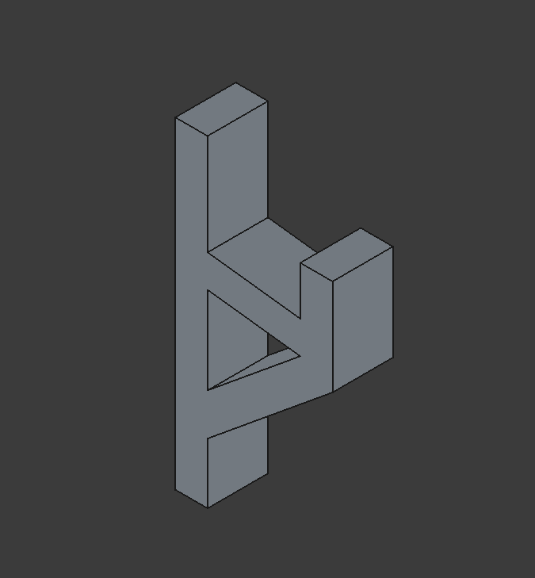
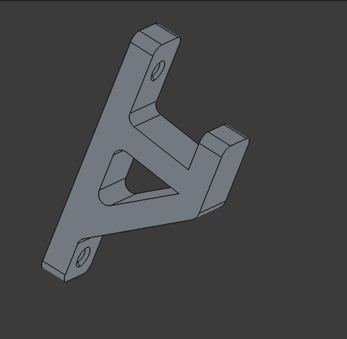
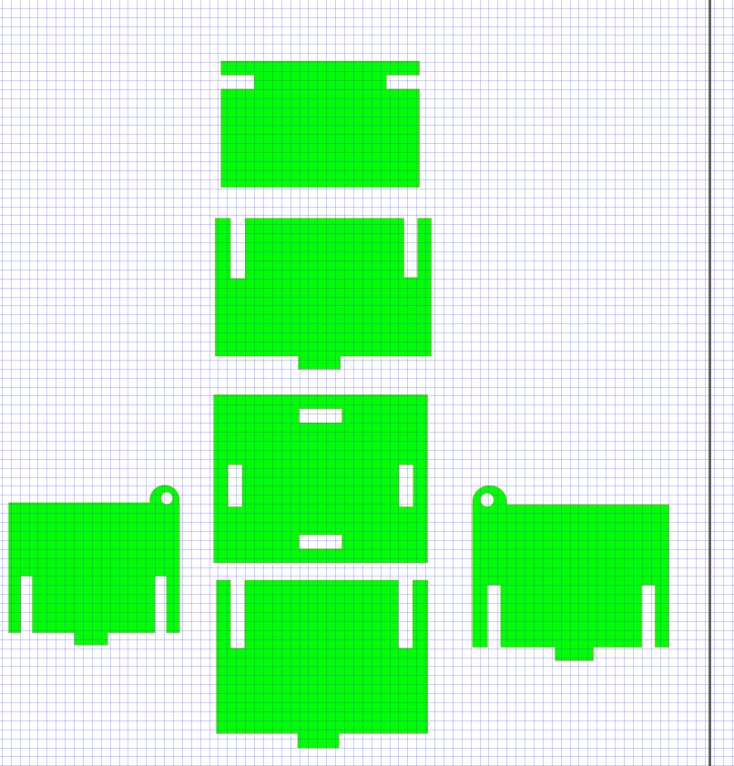

# 2. Activity of Day 2

## Digital Modeling for Fabrication

Digital modeling for fabrication is the process of creating precise, production-ready digital designs that serve as direct instructions for manufacturing machines. It emphasizes accurate dimensions, correct scaling, valid geometry, and appropriate file formats to ensure designs can be fabricated without error.
Digital modeling for fabrication is important because manufacturing machines execute designs exactly as modeled. Proper modeling prevents fabrication errors, reduces material waste, and lowers production costs. It ensures compatibility with machines and materials, supports efficient workflows through Design for Manufacturing (DFM) principles, and enables reliable translation from digital models to physical products.
## Activity 1

In this activity we made an L-Shaped Mounting Bracket in 3D using FreeCAD. This software helps in creating 3D objects. Below is the 3d picture we had to recreate 

{ width=600 align=center }

When I opened FreeCad, i first drew the front view of the object and assigned dimensions to it. I also applied various constraints like parallel, vertical, horizontal and perpendicular.
{ width=600 align=center }

After the diagram was fully constrained, i applied padding to the object and looked like like this

{ width=600 align=center }

Now for it to look like the design various things had to be applied like pockets, chamfer and fillets to get the details of the holes, the distance of the holes and the edges. It finaly looked like this after everything.

{ width=600 align=center }

## Activity 2
In this activity we used Inkscape to design a 2D Vector Press-Fit Box Panel. The goal was to make A flat rectangular panel with Rectangular slots cut into the edges.Slots sized to match material thickness designed to slide and lock with other panels.
I applied grid lines to help me estimate the spaces i will create like holes and cuts. I first created a rectangles for all the parts then to create the holes i drew a small rectangle and used path tab and applied difference to all. For the circle egdes a circle was drawn and applied unioun to join them and applied difference again with smaller circles and finished the design. This is how it looks after everything.
 
{ width=600 align=center }

* Download reference
[ Download Press-Fit Box Panel (Inkscape)](../files/inkscape/drawing1class.svg){: .md-button:download }

[ Download Freecadfiles (FreeCad)](../files/freecad/task1.FCStd){: .md-button:download }

[FreeCadfiles](https://github.com/NdhloziNomsa/Fabrication-lab-class/tree/main/Nomsa%20Template/DocumentationNomsa/docs/freecad)

[Inkscapefiles](https://github.com/NdhloziNomsa/Fabrication-lab-class/tree/main/Nomsa%20Template/DocumentationNomsa/docs/inkscape)

