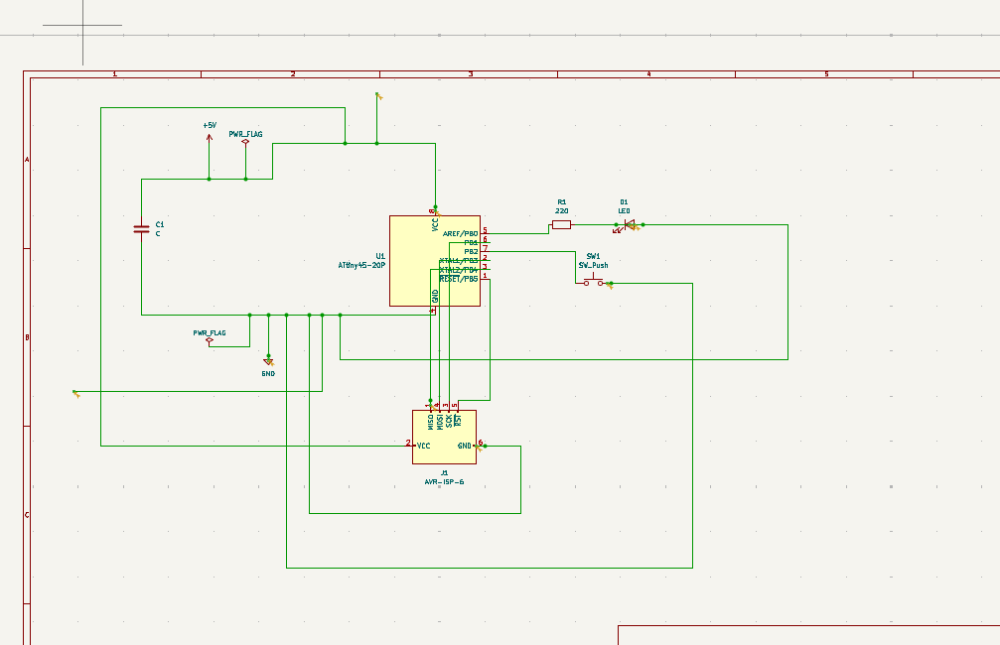
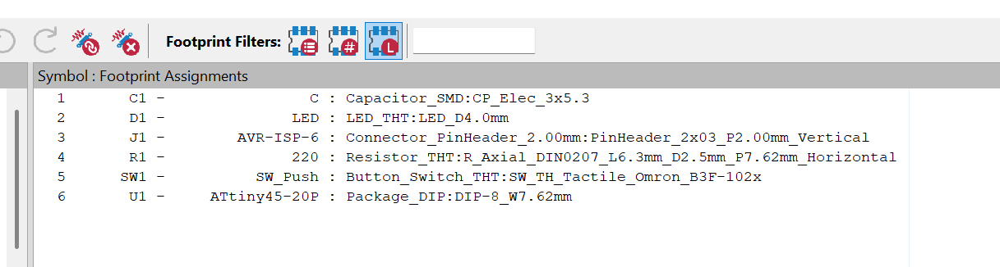
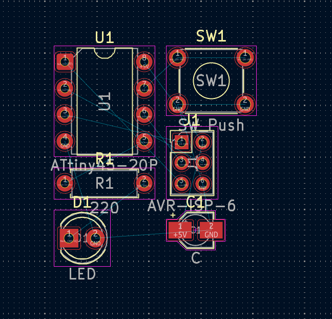

# 3. Activity of Day 3

## PCB Milling Techniques & Fabrication Process

KiCad is a free, open-source PCB design tool that supports the entire process from schematic creation to fabrication-ready outputs. The workflow begins with designing a clear and accurate schematic, assigning correct footprints to components, and arranging them on the PCB layout. Proper component placement and thoughtful routing improve signal integrity, reduce interference, and ensure the board fits its intended physical constraints.

Design for Manufacturability (DFM) is essential throughout the layout process. Design Rule Checks (DRC) help identify errors such as clearance violations and unconnected nets before fabrication. When designing for PCB milling, special attention must be given to wider traces, increased spacing, fewer vias, and often single-sided boards to match the limitations of milling machines.

The final stage involves generating fabrication files, including Gerber and drill files, which are used by PCB mills and manufacturers. These files should always be inspected using a Gerber viewer to catch errors early. Overall, successful PCB design with KiCad requires thinking beyond the screen and designing with real-world manufacturing constraints in mind.

## After Class Activity
## Single-Sided Microcontroller PCB Design using Kicad

In this activity we were designing a single sided Microcontroller with KiCad. We were suppossed to design ATtiny45 LED Control with Push Button & ISP Programming.This Microcontroller will have a push button that will control and LED and it should be for for PCB milling and hand Soldering.
## Schematic Design

{ width=400 align=center }

In this design i placed ATtiny45 symbol and added LED + resistor, Push button, Power connector, 6-pin ISP header
0.1 µF capacitor between VCC & GND

## Assigning footprints
{ width=400 align=center }

Every component was assigned to its footprint. Assigning footprints is important because it connects schematic symbols to the physical components that will be mounted on the PCB. Footprints define the real size, pad layout, and spacing of components, ensuring they fit correctly and can be soldered reliably.
 
## PCB layout
{ width=200 align=left }
This is the PCB layout of the circuit. Once the schematic is correct, the PCB design focuses on physically placing components and routing traces based on those verified connections.
This is the 3D view of the circuit.

{ width=400 align=center }

## After Class Activity

* Download reference

[ Download kicad folder (kicad)](../files/kicad.zip){: .md-button:download }

[kicadfolder](https://github.com/NdhloziNomsa/Fabrication-lab-class/tree/main/Nomsa%20Template/DocumentationNomsa/docs/kicad/project1)

[Gerberfiles](https://github.com/NdhloziNomsa/Fabrication-lab-class/tree/main/Nomsa%20Template/DocumentationNomsa/docs/kicad/project1/new%20gerber%20files)

