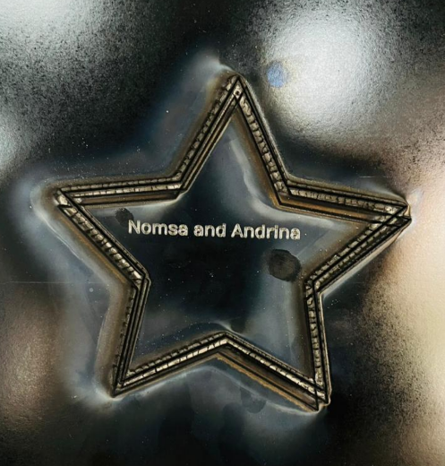

# 5. Activity of Day 5

## Digital Fabrication I: CNC & Laser Cutting
Laser cutting is a digital fabrication process that uses a focused, high-power laser beam to cut or engrave materials such as wood, acrylic, plastics, and thin metals. Its key advantages are high precision, speed, and repeatability, making it suitable for prototyping and production. The laser source determines the type of materials that can be processed.

The machine works through an integrated system. Mirrors and a focusing lens guide and concentrate the laser beam, while the motion system moves the laser accurately along X and Y axes. The workbed supports the material, and exhaust and cooling systems manage heat, smoke, and fumes to protect both the machine and the operator.

Laser cutter operation relies on software that converts digital designs into machine instructions and allows control of power, speed, and cutting paths.

## The design made

{ width=400 align=center }
 
On this day we learnt how to operate a laser cutting machine. We accessed it through its IP address through a computer on the same network. We controlled this machine on the computer by drawing the shape, controlling the postion of the cutter, engraving a name on it and controlling number of parses and how fast it should operate.
To create the picture above we drew the star and engraved the names on it. The machine First wrote the names then later increased the parses to cut it out.

