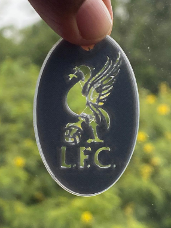
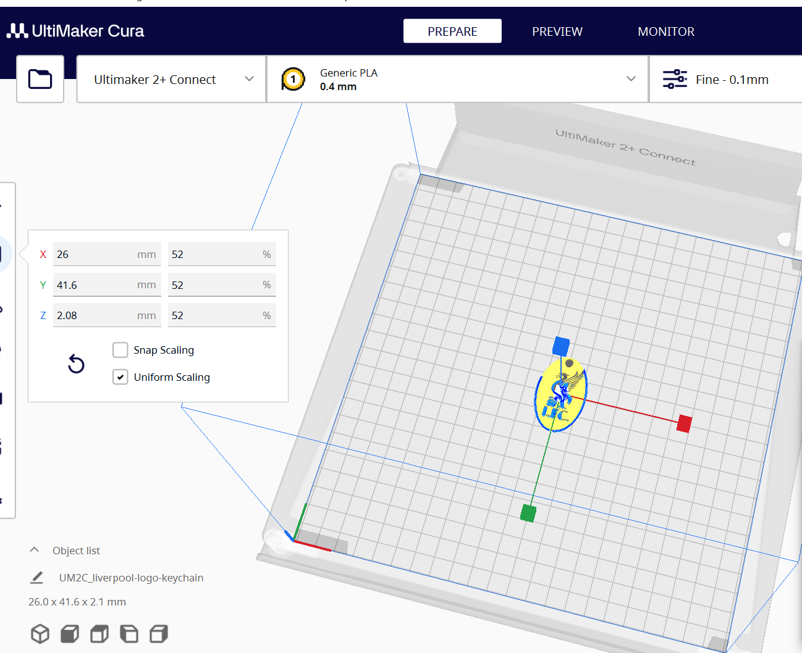

# 6. Activity of Day 6

##  Digital Fabrication II: Additive Manufacturing
3D printing with an Ultimaker uses Fused Deposition Modeling (FDM) to create objects layer by layer from a digital 3D model. This additive manufacturing process transforms virtual designs into physical parts. An Ultimaker printer consists of key components such as the print head, filament system, build plate, motion system, and control electronics. Successful printing includes loading filament, leveling and cleaning the build plate, preheating the printer and printing the design.

{ width=400 align=center }

This day we practised additive manufacturing using a printer called Ultimaker 2+ Connect. This printer is used to print 3d objects. Once the object is designed using many applications like FreeCad, the file is uploaded to the Ultimaker cura software where adjustments are made to suit printing time.
In our case, due to time constraints, we downloaded already made 3d files and uploaded them to the software to slice it. 
I downloaded a liverpool key chain to print. I sliced so small that the printer took 32 minutes with a grey filament. Below are the settings in cura software that printed the picture above.

{ width=300 align=left }   { width=400 align=right}

* Download reference

Links to reference files, PDF, booklets,

